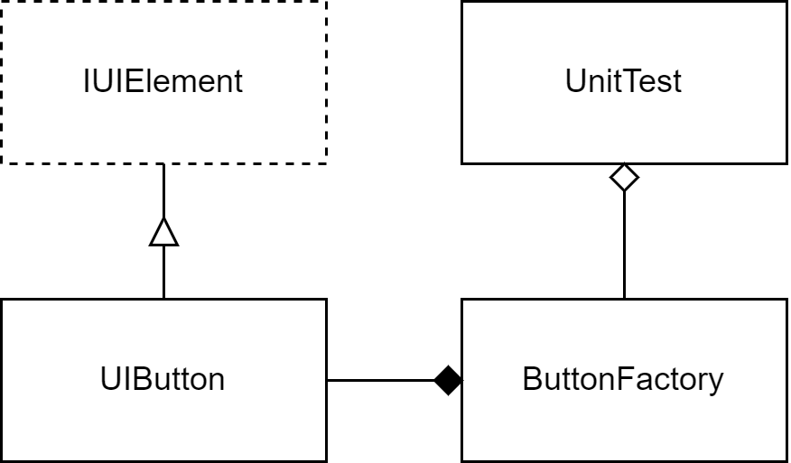

# Overview
The **Flyweight design pattern** is a structural design pattern that aims to minimize memory usage or computational expenses by sharing as much as possible with related objects. It achieves this by dividing objects into intrinsic (shared) and extrinsic (unique) states. The intrinsic states are shared among multiple objects, while the extrinsic states are unique to each object.

**Real world** applications of the Flyweight pattern include the following:
- Text Processing: In text editors, the Flyweight pattern can be applied to efficiently represent characters or fonts. Commonly used characters and fonts are shared among different text objects, reducing memory consumption.
- Graphics and Gaming: In graphics applications and games, the Flyweight pattern can be used to manage objects like sprites, which may have common properties (intrinsic) such as position and image data, but unique properties (extrinsic) like color or orientation. This optimization helps improve rendering performance.

# Design
This project defines `UIButton` that implements `IUIElement`. The `ButtonFactory` creates and manages the objects of `UIButton`. The `UIButton` contains `label`, `color` as intrinsic and its rendering coordinates as extrinsic states. The `ButtonFactory` creates a new object of `UIButton` only if an `UIButton` object of same intrinsic was not created in the past; thus demonstrating the Flyweight design pattern.

# Environment
The project builds and runs with Visual Studio Community 2022 when the required workloads are installed.
